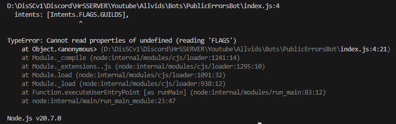
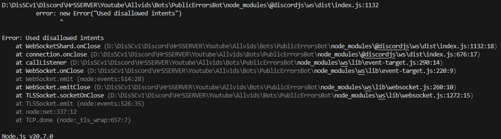
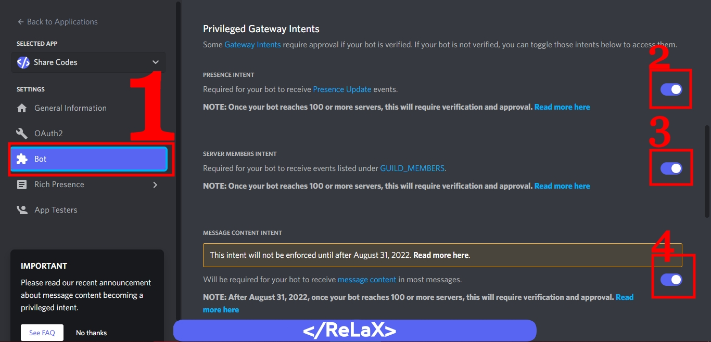
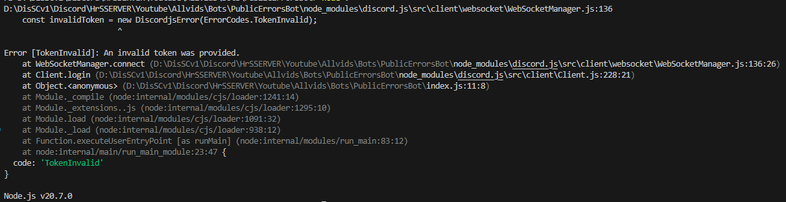
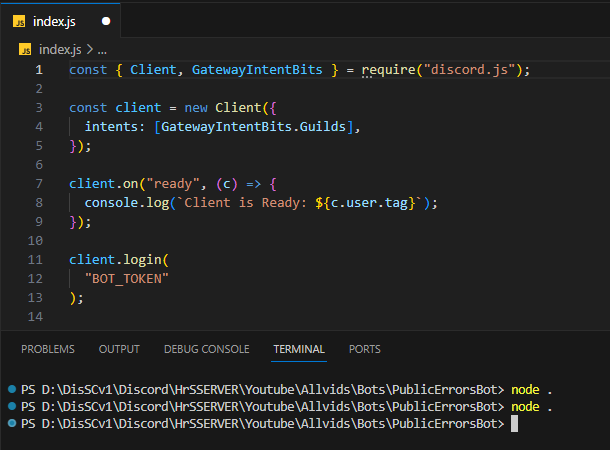

<div align="center">
	<br />
	<p>
		<a href="https://mrhrs.xyz"></a>
	</p>
	<br />
	<p>
		<a href="https://discord.gg/6CuMuv5Yzg"></a>
		<a href="https://youtube.com/@Mr_HrS"></a>
		<a href="https://paypal.me/MMahmoud345?country.x=SA&locale.x=ar_EG"></a>
	</p>
</div>

<div align="center">

# السلام عليكم ورحمة الله و بركاتة 💡

</div>

<div align="center">

## #️⃣ 1- Flags & GatewayIntentBits (Client)

</div>

**اول مشكلة دايما تواجه الكل زي ما تشوف هذي الصوره:**



- **طبعا حل هذي المشكلة مره بسيطه و سببها انك محمل اخر اصدار من `Discord.js` فعشان كذا مو متوافق الاصدار الحالي مع بوتك**
- **حل المشكلة بكل اختبار انك تعدل الـ `Intents` و تخليها `GatewayIntentBits` او تخليها متناسقة مع اصدار `Discord.js` حقك**
- **الاختلافات من اصدار `v13` الى `v14`**

```diff
- const { Client, Intents } = require('discord.js');
+ const { Client, GatewayIntentBits, Partials } = require('discord.js');

- const client = new Client({ intents: [Intents.FLAGS.GUILDS], partials: ['CHANNEL'] });
+ const client = new Client({ intents: [GatewayIntentBits.Guilds], partials: [Partials.Channel] });
```

**رسالة الايرور:**

```sh
const client = new Client({ intents: [Intents.FLAGS.GUILDS] });;
                                              ^

TypeError: Cannot read properties of undefined (reading 'FLAGS')
    at Object.<anonymous> (D:\Your\Bot\Path\index.js:3:47)
    at Module._compile (node:internal/modules/cjs/loader:1241:14)
    at Module._extensions..js (node:internal/modules/cjs/loader:1295:10)
    at Module.load (node:internal/modules/cjs/loader:1091:32)
    at Module._load (node:internal/modules/cjs/loader:938:12)
    at Function.executeUserEntryPoint [as runMain] (node:internal/modules/run_main:83:12)
    at node:internal/main/run_main_module:23:47

Node.js v20.7.0
```

---

<div align="center">

## #️⃣🔴 2- Used Disallowed Intents (Important)

</div>

**ثاني مشكلة دايما تواجه الكل زي ما تشوف هذي الصوره:**



- **المشكلة تظهر بسبب انك تستخدم صلاحيات مو موجوده بالبوت او صلاحيات ما معطيها للبوت في موقع [Discord Developers](https://discord.com/developers)**
- **طريقة حل المشكلة:**



**رسالة الايرور:**

```sh
D:\Your\Bot\Path\node_modules\@discordjs\ws\dist\index.js:1132
          error: new Error("Used disallowed intents")
                 ^

Error: Used disallowed intents
    at WebSocketShard.onClose (D:\Your\Bot\Path\node_modules\@discordjs\ws\dist\index.js:1132:18)
    at connection.onclose (D:\Your\Bot\Path\node_modules\@discordjs\ws\dist\index.js:676:17)
    at callListener (D:\Your\Bot\Path\node_modules\ws\lib\event-target.js:290:14)
    at WebSocket.onClose (D:\Your\Bot\Path\node_modules\ws\lib\event-target.js:220:9)
    at WebSocket.emit (node:events:514:28)
    at WebSocket.emitClose (D:\Your\Bot\Path\node_modules\ws\lib\websocket.js:260:10)
    at TLSSocket.socketOnClose (D:\Your\Bot\Path\node_modules\ws\lib\websocket.js:1272:15)
    at TLSSocket.emit (node:events:526:35)
    at node:net:337:12
    at TCP.done (node:_tls_wrap:657:7)

Node.js v20.7.0
```

---

<div align="center">

## #️⃣ 3- Invalid Token

</div>

**ثالث مشكلة دايما تواجه الكل زي ما تشوف هذي الصوره:**



- **سبب المشكلة هي ان توكن بوتك تغير او توكن البوت غير صالح فـ تقدر تروح لموقع [Discord Developers](https://discord.com/developers) و تسوي توكن جديد للبوت من `Rest Token`**

**رسالة الايرور:**

```sh
D:\Your\Bot\Path\node_modules\discord.js\src\client\websocket\WebSocketManager.js:136
    const invalidToken = new DiscordjsError(ErrorCodes.TokenInvalid);
                         ^

Error [TokenInvalid]: An invalid token was provided.
    at WebSocketManager.connect (D:\Your\Bot\Path\node_modules\discord.js\src\client\websocket\WebSocketManager.js:136:26)
    at Client.login (D:\Your\Bot\Path\node_modules\discord.js\src\client\Client.js:228:21)
    at Object.<anonymous> (D:\Your\Bot\Path\index.js:11:8)
    at Module._compile (node:internal/modules/cjs/loader:1241:14)
    at Module._extensions..js (node:internal/modules/cjs/loader:1295:10)
    at Module.load (node:internal/modules/cjs/loader:1091:32)
    at Module._load (node:internal/modules/cjs/loader:938:12)
    at Function.executeUserEntryPoint [as runMain] (node:internal/modules/run_main:83:12)
    at node:internal/main/run_main_module:23:47 {
  code: 'TokenInvalid'
}

Node.js v20.7.0
```

---

<div align="center">

## #️⃣🔴 4- Event Ready (UnSaved File (Important))

</div>

**رابع مشكلة و هي اهم شي حاليا و غالبا تواجه الكل زي ما تشوف هذي الصوره:**



- **هذي المشكلة اذا تعتقد انها صعبة فـ احب اقولم انها مره سهله و حلها مره بسيط و المشكلة في الموضوع انك ما حفظت الملف**

1. **عشان تحفظ الملف تقدر تسوي `Ctrl + S` و بكذا تكون قدرت تحفظ الملف**
2. **الطريقة الثانيه و هي انك تفعل `Auto Save` و طريقة تفعيله ب انك تروح من فوق على اليسار و تضغط على `File` بعدين تنزل تحت و تدور على شي اسمة `Auto Save` فعلها خلها تصير على جنبها علامة ✔️**

**رسالة الايرور:**

```sh
D:\Your\Bot\Path> node .
D:\Your\Bot\Path> node .
```

